I work on two sides of the same problem: **AI systems** (medical imaging, multimodal fusion, LLM tooling) and the **robots that run them** (ROS 2, RL locomotion, sim-to-real). Most of what's below either ships as open source or is headed to a paper.

> 🔒 A few research repos below are private until their papers are submitted or published — links will go live with the papers.

---

## Open Source

### [trajlens](https://github.com/Kunal-Somani/trajlens) — ruff for robot data

Lints [LeRobotDataset](https://github.com/huggingface/lerobot) datasets (v2.0–v3.0) against their own declared metadata — 16 checks across structural, semantic, temporal, statistical, and video categories, with terminal / JSON / HTML / SARIF reports that drop straight into CI. Validated by auditing a random sample of 100 public Hugging Face Hub datasets: two known upstream `lerobot` bugs were found in **~19%** and **~3%** of successfully linted datasets.

### [bodhirax](https://github.com/Kunal-Somani/bodhirax) — local-first LLM prompt eval studio
A visual studio for testing and comparing prompts across Ollama, OpenAI, Anthropic, Groq, and Hugging Face — runs entirely on your machine, keys never leave localhost. Exact / fuzzy / embedding / LLM-judge metrics. Final checks in progress; launching soon.

### Upstream contributions
| Project | Contribution |
|---|---|
| [deepset-ai/haystack](https://github.com/deepset-ai/haystack/pulls?q=is%3Apr+author%3AKunal-Somani+is%3Amerged) + [core-integrations](https://github.com/deepset-ai/haystack-core-integrations/pulls?q=is%3Apr+author%3AKunal-Somani+is%3Amerged) | 4 merged PRs in the Haystack LLM orchestration framework |
| [JdeRobot/RoboticsAcademy](https://github.com/JdeRobot/RoboticsAcademy/pulls?q=is%3Apr+author%3AKunal-Somani+is%3Amerged) | 16 merged PRs — fixed an FP16 crash in the object-detection pipeline, refactored the Hardware Abstraction Layer, shipped 52 unit tests |

---

## Research

| Work | Area | Status |
|---|---|---|
| [MRI Reconstruction](https://github.com/Kunal-Somani/MRI_Reconstruction) — dual-branch physics-guided deep learning; learned gating routes k-space adaptively, no anatomy labels at inference. +1.78% SSIM, 112 ms/slice | Medical imaging | Conference paper under review — IEEE SPL · Dr. Anurag Tiwari, TIET |
| [ThermoBridge](https://github.com/Kunal-Somani/thermobridge) 🔒 — bidirectional 3D MRI↔CT synthesis via Brownian-bridge diffusion with a learnable 3D anisotropic-diffusion mixer | Medical imaging | Paper in preparation · Dr. Anurag Tiwari, TIET |
| Multi-Modal Sensor Fusion for SLAM in Visually Degraded SAR Environments — pipeline-oriented survey of 55 systems (2011–2025) | SAR robotics | Survey submitted · Dr. Ankit Soni, TIET |
| SAR rover — simulated multi-modal (audio-visual-thermal) search-and-rescue platform 🔒 | SAR robotics | Journal paper #2, in progress · Dr. Ankit Soni, TIET |
| [Parkinson's early detection](https://github.com/eshaansingla/ParkinsonsEarlyPrediction) — CNN on voice + DNN on MPU9250 tremor, late fusion 88% → 91%, ESP32 sensor-to-inference pipeline | Multimodal ML | ELC summer research, TIET |

---

## Robotics

### [Canary Rover](https://github.com/Kunal-Somani/canary-rover) — autonomous mine-inspection scout · capstone
PPO-trained locomotion (200K timesteps, PyBullet) → ROS 2 sensor stack (IMU / RPLiDAR / 4× BLDC encoders) → full Isaac Sim 5.1 simulation with live sensor feeds. **Currently in sim-to-real transfer; physical rover roughly half built.** Team of 5.

### [object_finder](https://github.com/Kunal-Somani/object_finder) — map-less warehouse AMR · [▶ demo video](https://github.com/user-attachments/assets/c1a75752-a5f5-46bc-b5e6-5bc591ea847e)
ROS 2 Humble skid-steer robot that navigates without SLAM: FSM + PD wall-following on 360° LiDAR, HSV + depth target tracking, tested in the AWS Small Warehouse Gazebo world.

---

## Engineering Systems

| Project | One line |
|---|---|
| [Archon](https://github.com/Kunal-Somani/archon) | Natural-language brief → live deployed site: hybrid RAG (dense + BM25, RRF), grammar-constrained codegen, GitHub App deployer, Celery workers, full Prometheus/Grafana/OTel observability |
| [Axon](https://github.com/Kunal-Somani/axon-core) | Fully local tri-modal assistant (text/speech/vision) — BART-MNLI router, hybrid RAG with cross-encoder reranking, GBNF-constrained tool calls, zero external LLM APIs |
| [Helix](https://github.com/Kunal-Somani/helix-agent) | Autonomous recursive web-task agent with a RestrictedPython sandbox, durable async jobs, and live-streamed run logs |

---

## Tech Stack

**Languages**

**Robotics & Simulation**

**AI & Computer Vision**

**Backend, Data & Infra**

---

## Activity

Now: physics-guided medical imaging · sim-to-real RL navigation · multimodal SAR fusion · robot-data tooling

